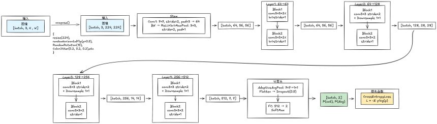

# 作业一：基于深度神经网络的猫狗图像分类

## 一、方法

### 1. 模型结构

这里使用的是RestNEt18的backbone+2分类头

#### 损失函数

本实验使用 **CrossEntropyLoss（交叉熵损失函数）**：

$$L = -\sum_{i} y_i \cdot \log(p_i)$$

其中：
- $y_i$ 是真实标签（0，1）
- $p_i$ 是模型预测的第 $i$ 类概率

#### 模型总参数量

约 **11,689,000** 个可训练参数（其中ImageNet预训练权重约11M参数）。

---

## 二、实现细节

### 1. 实验环境

| 项目 | 配置 |
|------|------|
| 服务器 | 远程GPU服务器（8×RTX A6000） |
| 框架 | PyTorch 2.x |
| Python版本 | 3.10 |

### 2. 数据集

| 数据集 | 数量 | 类别分布 |
|--------|------|---------|
| 训练集 | 2000张 | 1000张猫 + 1000张狗 |
| 测试集 | 500张 | 250张猫 + 250张狗 |

图像预处理：Resize至224×224，ImageNet标准化

### 3. 数据增强

| 增强方法 | 参数 | 作用 |
|----------|------|------|
| 随机水平翻转 | p=0.5 | 50%概率翻转图像 |
| 随机旋转 | ±15度 | 增加旋转不变性 |
| 颜色抖动 | brightness=0.2 contrast=0.2 saturation=0.2 | 颜色多样性 |

### 4. 训练配置

| 参数 | 值 |
|------|-----|
| 优化器 | Adam |
| 学习率 | 0.001 |
| 学习率调度 | StepLR (step_size=5, gamma=0.5) |
| 损失函数 | CrossEntropyLoss |
| 批大小 (Batch Size) | 32 |
| 训练轮次 (Epochs) | 15 |
| Dropout | 0.5 |

### 5. 预训练

使用 **ImageNet预训练的ResNet18权重**进行迁移学习，显著提升收敛速度和最终性能。

---

## 三、实验结果

### Epoch-Train/Val结果

| Epoch | Train Loss | Train Acc | Test Acc | Cat Acc | Dog Acc |
|:-----:|:----------:|:---------:|:--------:|:-------:|:-------:|
|   1   |   0.3186   |   86.10   |   90.20  |  99.60  |  80.80  |
|   6   |   0.1035   |   95.55   |   97.20  |  97.60  |  96.80  |
|   7   |   0.0622   |   97.80   |   97.60  |  96.80  |  98.40  |
|  15   |   0.0053   |   99.90   |   96.00  |  98.00  |  94.00  |

### Test 结果

| 指标 | Cat (0) | Dog (1) | Macro Avg |
|:-----|--------:|--------:|----------:|
| Accuracy | - | - | 95.69% |
| Precision | 97.23% | 98.38% | 97.81% |
| Recall | 98.40% | 97.20% | 97.80% |
| F1 Score | 97.81% | 97.79% | 97.80% |

## 四、分析与讨论
使用ImageNet预训练的ResNet18权重显著提升了模型性能。相比从零训练，预训练模型能够在少量数据上快速收敛并获得较高的准确率。ImageNet的1000类预训练知识很好地迁移到了二分类任务。随机水平翻转、旋转和颜色抖动增加了训练数据的多样性，有效防止了模型过拟合，提高了泛化能力。在2000张训练数据的规模下，数据增强对于防止过拟合尤为重要。同时观察到 **Epoch 1**: 模型快速收敛，测试准确率已达90.20%。 **Epoch 6-7**: 达到最佳测试准确率97.60%。**Epoch 15**: 训练准确率高达99.90%，但测试准确率下降到96.00%，出现轻微过拟合
